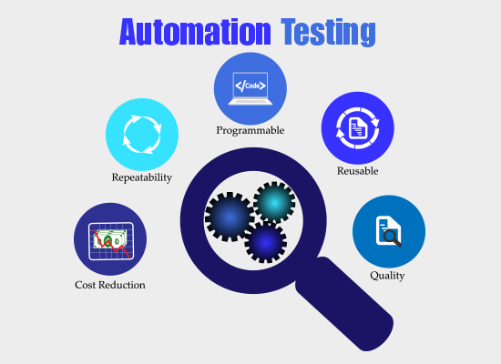

# Viết test để làm gì?

Có thể kể ra một số lợi ích khi viết test như:

-   Tự tin hơn trong việc tích hợp, bảo trì, mở rộng và refactor hệ thống

    Do đã có test case cho những function, chức năng trong hệ thống, nên việc refactor sẽ trở nên tự tin hơn, nếu có ảnh hưởng đến các phần khác thì chúng ta sẽ biết được thông qua việc test case bị failed.

-   Tích hợp CI/CD tự động hóa quá trình merge, deploy
-   Cải thiện kỹ năng của Developer

    -   Việc viết test giúp developer hiểu hơn về thiết kế code, tức là khi viết code bạn sẽ phải cân nhắc để làm sao cho đoạn code đó có thể dễ đọc, dễ hiểu và dễ test.

    -   Cover kỹ hơn yêu cầu hệ thống vì phải viết test case đầy đủ hơn và ghi nhớ thông qua việc viết ra suy nghĩ, thay vì chỉ test thủ công bằng việc suy nghĩ trong đầu.

    -   Giúp hiểu hơn về kiến trúc framework, vì khi viết test sẽ cần biết luồng hoạt động code, về cách hoạt động của DI và nhiều khi phải debug để tìm ra nguyên nhân test failed.

    -   Viết test giờ đây là một yêu cầu bắt buộc đối với hầu hết các dự án open source, vậy nên đây cũng là một kỹ năng quan trọng mà developer cần có nếu muốn làm đẹp profile của mình.
