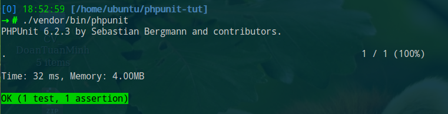

# PHPUnit

## Cài đặt

Cài đặt theo từng project:

```sh
composer require --dev phpunit/phpunit
```

Khi đó ta có tool:

```sh
./vendor/bin/phpunit
```

## Cấu hình

File cấu hình `phpunit.xml` (thường đã có sẵn trong project Laravel):

```xml

<?xml version="1.0" encoding="UTF-8"?>
<phpunit bootstrap="vendor/autoload.php"
         colors="true"
         convertErrorsToExceptions="true"
         convertNoticesToExceptions="true"
         convertWarningsToExceptions="true"
         processIsolation="false"
         stopOnFailure="true">
    <testsuites>
        <testsuite name="Integration">
            <directory suffix="Test.php">./tests/Integration</directory>
        </testsuite>
        <testsuite name="Unit">
            <directory suffix="Test.php">./tests/Unit</directory>
        </testsuite>
    </testsuites>
    <filter>
        <!-- For generate coverage report -->
        <whitelist processUncoveredFilesFromWhitelist="true">
            <directory suffix=".php">./app</directory>
        </whitelist>
    </filter>
    <php>
        <!-- Environment variables -->
        <env name="APP_ENV" value="testing"/>
        <env name="APP_KEY" value="App under test"/>
    </php>
</phpunit>
```

Environment variables có thể khai báo trực tiếp trong file `phpunit.xml` hoặc sử dụng file `env.testing` (Laravel):

```ini
APP_NAME="App Test"
APP_KEY=...
APP_DEBUG=false
APP_URL=http://localhost

DB_CONNECTION=mysql
DB_HOST=127.0.0.1
DB_PORT=3306
DB_DATABASE=db_test
DB_USERNAME=db_test
DB_PASSWORD=secret
```

## Chạy test

### Chạy toàn bộ test case

```sh
./vendor/bin/phpunit
```

### Chạy từng test suite

```sh
./vendor/bin/phpunit --testsuite=Unit
./vendor/bin/phpunit --testsuite=Integration
```

### Chạy từng file

```sh
./vendor/bin/phpunit tests/Unit/ProductServiceTest.php
```

### Filter test case

```sh
./vendor/bin/phpunit --filter 'TestNamespace\\TestCaseClass::testMethod'
./vendor/bin/phpunit --filter 'TestNamespace\\TestCaseClass'
./vendor/bin/phpunit --filter TestNamespace
./vendor/bin/phpunit --filter TestCaseClass
./vendor/bin/phpunit --filter testMethod
```

### Format output

```sh
./vendor/bin/phpunit --testdox
```



## Example test

```php
<?php
// tests/Unit/CalculatorTest.php
namespace Tests\Unit;

use PHPUnit\Framework\TestCase; // PHPUnit_Framework_TestCase (old version)
use App\Calculator;

class CalculatorTest extends TestCase
{
    public function test_add_return_correct_value()
    {
        // Given (these numbers)
        // Arrange input
        $numbers = [1, 2];

        // When (add them)
        // Act: call unit
        $calculator = new Calculator; // Class Under Test
        $actualResult = $calculator->add($numbers); // Method Under Test

        // Then (verify the result is correct)
        // Assert
        $expectedResult = 3;
        $this->assertEquals($expectedResult, $actualResult);
    }
}
```

Thường được chia thành 3 phần theo các pattern:

-   Given - When - Then
-   Arrange - Act - Assert

## Setup and Teardown

PHPUnit TestCase cung cấp một số method hỗ trợ cho việc chuẩn bị (arrange) input:

-   `setUp()`: Chạy trước mỗi method test
-   `tearDown()`: Chạy sau mỗi method test
-   `setUpBeforeClass()`: Chạy khi bắt đầu class test
-   `tearDownAfterClass()`: Chạy sau khi kết thúc class test

Ví dụ:

```php
class ExampleTest extends TestCase
{
    protected static $db;

    protected $classUnderTest;

    public static function setUpBeforeClass()
    {
        self::$db = new PDO('sqlite::memory:');
    }

    public function setUp()
    {
        parent::setUp();
        $this->classUnderTest = new MyClass;
        // Database begin transaction
        self::$db->beginTransaction();
    }

    public function test_add_return_correct_value()
    {
    }

    public function test_add_throws_exception_if_input_is_nan()
    {
    }

    public function tearDown()
    {
        // Rollback transaction for fresh database state
        self::$db->rollback();
    }

    public static function tearDownAfterClass()
    {
        self::$db = null;
    }
}
```

Trình tự PHPUnit thực hiện test:

---

(1) `ExampleTest::setUpBeforeClass()`

---

(2) `ExampleTest::setUp()`

(3) `ExampleTest::test_add_return_correct_value()`

(4) `ExampleTest::tearDown()`


---

(5) `ExampleTest::setUp()`

(6) `ExampleTest::test_add_throws_exception_if_input_is_nan()`

(7) `ExampleTest::tearDown()`


---

(8) `ExampleTest::tearDownAfterClass()`

---

## Assertion

```php
**
 * Verify $actualValue equals to $expectedValue?
 * Nếu không đúng, thì show ra message
 * Nếu không truyền vào message thì PHPUnit sẽ tự động generate:
 * => Failed asserting that 4 matches expected 5.
 */
function assertEquals($expectedValue, $actualValue, $message = '')
```

Một số assertion thường dùng:

-   `assertTrue()` <> `assertFalse()`
-   `assertEquals()` <> `assertNotEquals()`: So sánh bằng
-   `assertSame()` <> `assertNotSame()`: So sánh bằng, cùng kiểu
-   `assertContains()` <> `assertNotContains()`: Array contain, String contains
-   `assertArrayHasKey()` <> `assertArrayNotHasKey()`
-   `assertInstanceOf()` <> `assertNotInstanceOf()`: Đối tượng thuộc class
-   `assertCount()`
-   `expectException()`: Expect sẽ có Exception khi gọi chạy unit, chú ý phải gọi trước khi gọi method / function
    ```php
    public function test_foo()
    {
        $this->expectException(InvalidArgument::class);
        $this->classUnderTest->execute();
    }
    ```

### Best practices

Sử dụng assertion phù hợp

-   Code dễ đọc hiểu hơn
-   Nếu assert failed thì message sinh ra cũng dễ hiểu hơn
-   Signature của các method assert thường có các tham số theo thứ tự là expected value (giá trị mong muốn), actual value (giá trị thực tế khi chạy unit), message (message thông báo nếu fail) nên cần truyền theo thứ tự để PHPUnit có thể generate ra message báo lỗi chính xác

```php
$this->assertEquals($expected, $actual);
// => Failed asserting that $actual matches expected $expected.
$this->assertTrue($expected == $actual);
// => Failed asserting that false is true??

$this->assertSame($expected, $actual);
$this->assertTrue($expected === $actual);

$this->assertContains($element, $array);
$this->assertTrue(in_array($element, $array);

$this->assertCount($expected, $actual);
$this->assertTrue(count($actual) == $expected);

$this->assertInstanceOf(ExpectedClass::class, $actual);
$this->assertTrue($actual instanceOf ExpectedClass);
```

## Data provider

Sử dụng `@dataProvider` cho những trường hợp chỉ khác nhau input, output

```php
/**
 * @dataProvider provider_test_foo
 */
public function test_foo($variableOne, $variableTwo)
{
    $this->assertEquals($variableOne, $this->classUnderTest->execute($variableTwo));
}

public function provider_test_foo()
{
    return [
        ['test 1, variable one', 'test 1, variable two'],
        ['test 2, variable one', 'test 2, variable two'],
        ['test 3, variable one', 'test 3, variable two'],
    ];
}
```
