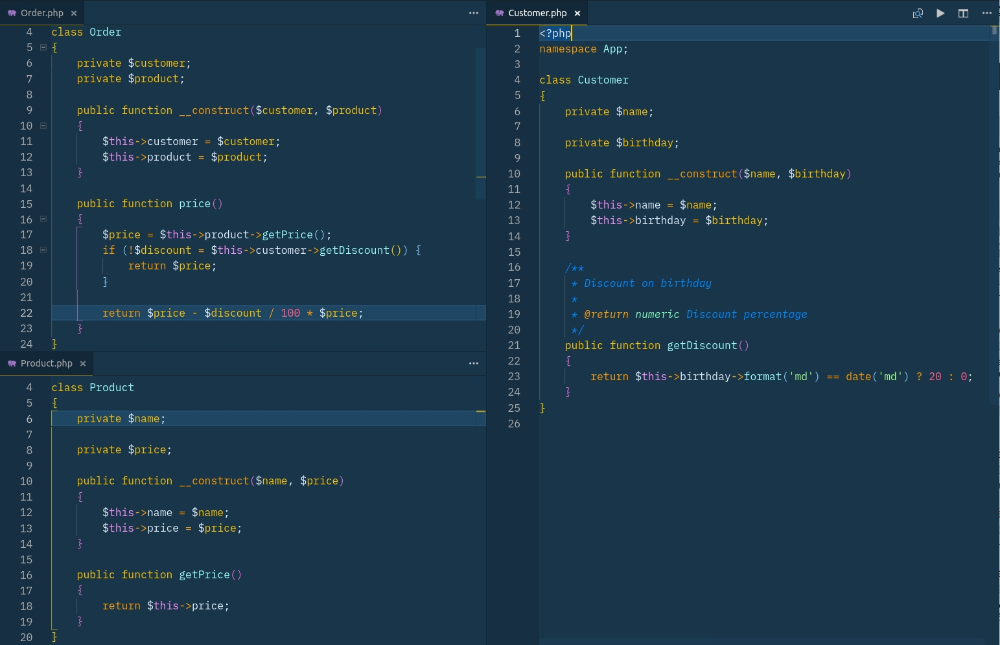

# Test Doubles và DI

## Khái niệm

Một trong những yêu cầu cơ bản của Unit Test đó là tính **cô lập** (**isolation**). Nhìn chung thì tính cô lập là rất khó (nếu không muốn nói là không thể) bởi luôn luôn có rất nhiều dependencies trong cả project.

Vì thế, khái niệm về `Test Doubles` ra đời. Một `Test Double` cho phép chúng ta loại bỏ dependency nguyên bản, từ đó giúp cô lập unit.

Dưới đây là một vài loại `Test Doubles`

_Một vài phần trong các định nghĩa sau được lấy từ bài viết [Mocks Aren't Stubs](https://martinfowler.com/articles/mocksArentStubs.html) trên blog của Martin Fowler_

### Dummies

-   Dummy là objects được truyền vào nhưng mà không hề được sử dụng. Chúng thường chỉ được dùng để hoàn thành danh sách parameter.

### Fake

-   Fake objects thực ra có mang những triển khai logic, thế nhưng thường sử dụng những "lối tắt", khiến chúng không thích hợp để triển khai trên production (Ví dụ như in memory database)

### Stubs

-   Stubs đưa ra những câu trả lời có sẵn cho các lời gọi hàm được thực hiện trong quá trình test, và thường sẽ không trả về bất cứ cái gì ngoài những thứ mà chúng đã được lập trình trong bài test.

### Mocks

-   Mocks là objects đã được lập trình trước với các expectations, tạo ra một đặc tả cho lời gọi mà chúng dự kiến sẽ nhận được.

## Test cô lập

Test cô lập:

-   Giả lập access API / web service ngoài (mạng)
-   Giả lập access database?
-   Giả lập lời gọi hàm từ các class khác?

Giả lập là gì?

-   Giả lập = thay thế các object sử dụng cho production với 1 một object giúp cho việc testing
-   Giả lập = thay thế real object với mock object
-   Mock object bắt chước hành vi của real object, nhưng chúng ta có thể tự định nghĩa kết quả trả về theo từng kịch bản test case

Có hai quan điểm về unit test cô lập:

-   **Sociable test**: Chỉ giả lập (mock) các dependencies gây chậm hoặc có side effects lớn hoặc không thể dùng trong test environment: database, network call...
-   **Solitary test**: Giả lập tất cả dependencies


> _[https://martinfowler.com/bliki/UnitTest.html](https://martinfowler.com/bliki/UnitTest.html)_

Ví dụ:
Có 3 class `Order`, `Customer`, `Product`, với yêu cầu khi user order 1 sản phẩm, nếu ngày order trùng với ngày sinh của user thì user sẽ được giảm 20%.



Class `Order` có 2 dependencies là `Product` và `Customer`, cần viết test cho method `Order::price()`:

-   **Sociable Test**: do `Product::getPrice()` và `Customer::getDiscount()` đều không có logic phức tạp hay có khả năng làm chậm test nên sẽ không thực hiện giả lập

    ```php
    namespace Tests\Unit;

    use PHPUnit\Framework\TestCase;
    use App\Customer;
    use App\Product;
    use App\Order;
    use DateTimeImmutable;

    class SociableOrderTest extends TestCase
    {
        public function test_price_return_correct_value()
        {
            $product = new Product('PS4', 100);
            $customer = new Customer('Hunter', new DateTimeImmutable(date('Y/m/d')));
            $order = new Order($customer, $product);

            $this->assertEquals(80, $order->price());
        }
    }
    ```

-   **Solitary Test**:

    ```php
    class SolitaryOrderTest extends TestCase
    {
        public function test_price_return_correct_value()
        {
            // Giả lập (mock) Product
            $product = $this->createMock(Product::class);
            // Expect $product->getPrice() được gọi 1 lần và trả về 100
            $product->expects($this->once())
                ->method('getPrice')
                ->willReturn(100);

            // Giả lập (mock) Customer
            $customer = $this->createMock(Customer::class);
            // Expect $customer->getDiscount() được gọi 1 lần và trả về 20
            $customer->expects($this->once())
                ->method('getDiscount')
                ->willReturn(20);

            $order = new Order($customer, $product);

            $this->assertEquals(80, $order->price());
        }
    }
    ```

Vì đã được giả lập nên khi logic của `Product::getPrice()` và `Customer::getDiscount()` thay đổi thì `SolitaryOrderTest` không cần phải update lại.

Vậy khi nào cần giả lập (mock), chúng ta có thể áp dụng cả 2 quan điểm:

-   Nếu code được cấu trúc tốt thì thường có 2 loại class:

    -   Model: nhiệm vụ chính là để lưu dữ liệu bên trong và không thực hiện nhiều logic bên trong => không cần mock, chỉ đơn giản là khởi tạo đối tượng và truyền vào fake data cho nó
    -   Service: nhiệm vụ chính là thực hiện công việc, logic => mock

    ```php
    class OrderTest extends TestCase
    {
        public function test_price_return_correct_value()
        {
            $product = new Product('PS4', 100);

            // Giả lập (mock) Customer
            $customer = $this->createMock(Customer::class);
            // Expect $customer->getDiscount() được gọi 1 lần và trả về 20
            $customer->expects($this->once())
                ->method('getDiscount')
                ->willReturn(20);

            $order = new Order($customer, $product);

            $this->assertEquals(80, $order->price());
        }
    }
    ```

-   Khi việc mock quá phức tạp hãy thực hiện refactor code hoặc thực hiện integration test

## Dependency Injection

-   Method `Order::price()` cần sử dụng `Product::getPrice()` và `Customer::getDiscount()` nên class `Order` có 2 dependencies là `Product` và `Customer`
-   Muốn giả lập thì các dependencies phải được khai báo tường minh (_explicit dependencies_), tức là được truyền vào constructor, class không có nhiệm vụ khởi tạo dependencies
-   Nếu khởi tạo bằng `new` hoặc dùng `static` method bên trong thì không có cách nào để giả lập (thực ra thì cũng có nhưng thường dùng trick về autoloading của PHP chứ PHP không hỗ trợ kỹ thuật _Monkey Patching_ (\*))

```php
// Bad method
public function register(array $inputs)
{
    // ...
    (new MailService())->send($user);
    // …
    MailService::send($user);
}
```

```php
// Good, using dependency injection
public function __construct(MailService $mailService)
{
    $this->mailService = $mailService;
}

public function register(array $inputs)
{
    $transaction = $this->mailService->send($user);
}
```

## Mocks vs Stubs

Có nhiều loại test doubles, nhưng chỉ cần focus vào 2 loại chính

### Stubs

Giả lập trạng thái => loại bỏ tất cả logic bên trong method của object thật và có thể thay đổi kết quả trả về của method theo ý muốn

```php
// Create mock object
$product = $this->createMock(Product::class);
// Stub method price, make it return 100
$product->method('getPrice')->will($this->returnValue(100));
```

### Mocks

Verify hành vi => khi method under test được gọi thì chúng ta **expect** mock method cũng được gọi, 1 lần hoặc 2 lần hoặc nhiều lần, được truyền tham số gì...

```php
public function test_order_sends_mail_if_succeeded()
{
    $mailService = $this->createMock(MailService::class);
    $order = new Order('Wine', 'user@localhost', $mailService);

    // Expect method MailService::send được gọi duy nhất 1 lần,
    // với 2 tham số là 'user@localhost' và 'Order succeeded!'
    // Expect cần được viết trước khi gọi method test
    $mailService->expects(once())
        ->method('send');
        ->with(
            $this->equalTo('user@localhost'),
            $this->equalTo('Order succeeded!')
        );

    $result = $order->process();

    $this->assertTrue($result);
}
```

## Tham khảo

(\*)

-   https://github.com/Codeception/AspectMock
-   https://github.com/kahlan/kahlan
-   https://github.com/infection/infection
-   https://www.phpspec.net/en/stable/
