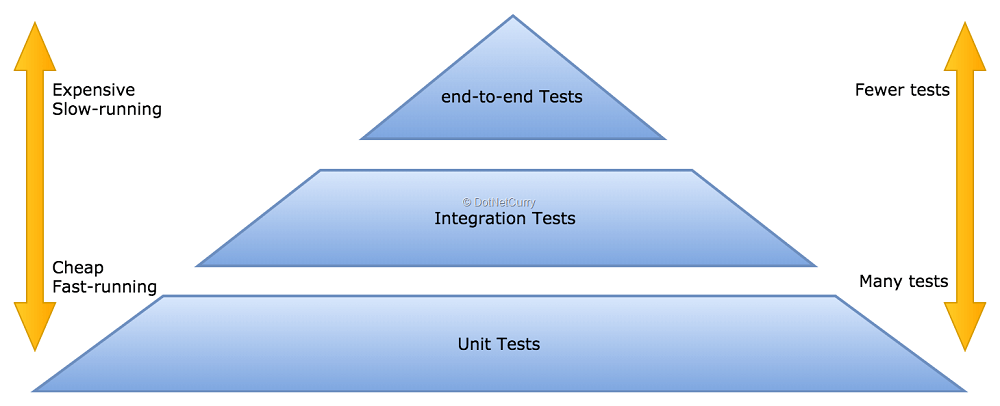
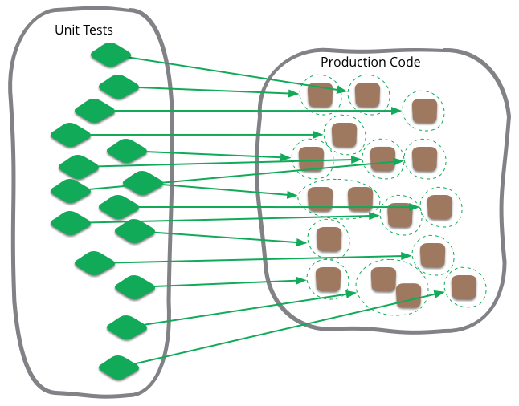

# Giới thiệu

Tài liệu này bao gồm một số lý thuyết cơ bản về unit test nói chung và cách triển khai cụ thể với framework Laravel và PHPUnit.

Thực tế thì có nhiều cách triển khai unit test, đặc biệt là đối với ngôn ngữ _mềm dẻo_ như PHP, và cũng có rất nhiều khái niệm như _unit test_, _integration test_, _feature test_, _system test_, _acceptance test_,.., hay các ý kiến là bạn phải viết như thế này, thế kia mới đúng...

Tuy nhiên, với mục đích là giúp developer có thể triển khai unit test một cách dễ dàng nhất, tài liệu này sẽ có nhiều ý kiến mang tính **_quan điểm_**, có thể nó sẽ không đúng trong mọi trường hợp, cũng như cố gắng sử dụng cách đơn giản nhất để triển khai.

Về tính hiệu quả thì chưa thể đánh giá được ngay, nhưng chúng tôi sẽ cố gắng đánh giá thường xuyên và cải thiện dần.

Rất mong nhận được ý kiến đóng góp của các bạn bằng cách tạo issue hoặc pull request để thảo luận, sửa lỗi...

## Quan điểm test

- Chọn cách đơn giản, không quá quan trọng phải là unit test thuần
- Follow theo tài liệu của framework để dễ dàng tìm kiếm, tích hợp
- Test code của project, không test code của framework, thư viện

Ví dụ với project Laravel:

- Controller: nếu viết theo kiểu unit test thuần thì đòi hỏi người viết phải có nhiều kiến thức về framework, theo như kinh nghiệm thì lần đầu viết, tôi phải `dd` xem response nó là gì, sau đó là đọc code framework xem làm sao để lấy ra value từ response để assert... mặc dù nó có thể giúp người viết hiểu sâu hơn về framework, nhưng nó phức tạp, tốn thời gian.

    Với cả controller thì chủ yếu chỉ để điều hướng request, không có nhiều logic thì việc viết unit test thuần có mang lại lợi ích?

    So với việc dùng [http tests](https://laravel.com/docs/8.x/http-tests), chúng ta có [tài liệu](https://laravel.com/docs/8.x/http-tests), có các helper method để viết test nhanh hơn, về tốc độ thì nó cũng không quá khác biệt so với unit test thuần vì gọi là HTTP test nhưng thực chất chỉ là sử dụng [HTTP Kernel](https://github.com/laravel/framework/blob/8.x/src/Illuminate/Foundation/Testing/Concerns/MakesHttpRequests.php#L496) để handle request internal, không liên quan đến network.

- Form request: đa phần thì class này chỉ thực hiện khai báo rules, không thực hiện logic gì đặc biệt nên không cần test riêng method `rules()` mà test gộp chung với controller

- Model: không cần test config các field như fillable, casts, hidden, visible qua unit tests vì phần này đã được Laravel test, việc cần test ở đây là nó có tích hợp với database đúng không, ví dụ tên trường có đúng với db, value có vượt quá limit,...

## Developer Test

Developer trước tiên chỉ cần focus vào 2 loại test

### Unit test

-   Unit Testing là một phương pháp kiểm thử phần mềm mà ở đó từng **đơn vị riêng lẻ** (Individual Unit) của source code được test
-   Ở trong PHP Project, viết Unit Test là việc viết test cho từng function hoặc method của một class
-   Unit test không thực hiện những việc sau:
    -   Truy vấn cơ sở dữ liệu (làm chậm quá trình test)
    -   Sử dụng network, gọi api bên ngoài (làm chậm, kết quả không ổn định vì phụ thuộc vào mạng)
    -   Sử dụng file system (làm chậm quá trình test)

### Integration test

-   Test việc kết hợp giữa các unit (function, method) với nhau => test một nhóm Unit

    Chẳng hạn Unit test, test từng method của Service và Controller sử dụng service

    -   => Integration sẽ test việc sử dụng kết hợp service và controller

    -   => Test route

-   Có thể truy vấn cơ sở dữ liệu (thiết lập một database test riêng biệt)
-   Có thể sử dụng file system (test việc import/export file, file permission...)

Với việc focus vào hai level test này, theo chúng tôi là tối ưu về cả thời gian viết và thời gian chạy test, cũng như đảm bảo được phần nào đó tính hiệu quả của việc test.
